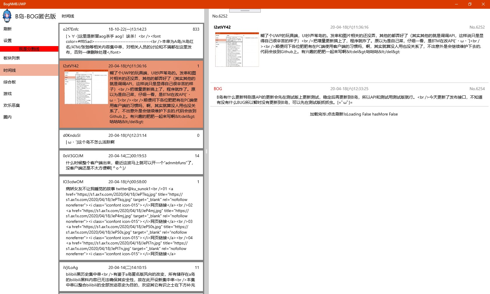

# BogNMB.UWP
[B岛匿名版](http://bog.ac)的非官方UWP客户端。为了开发方便SDK版本为1903，日后可能会修改

已实现的功能:
- 浏览版块
- 浏览帖子(串)
- 浏览回复
- 图片显示

按优先级降序的TODO:
- 处理HTML标签
- 对串号的解析和排版
- 图文混合排版
- 发串相关API接入
- 黑/白/自适应主题

License: GPL 3.0

有兴趣共同开发的请发我邮件或[telegram](
https://t.me/adios_verrickt)
